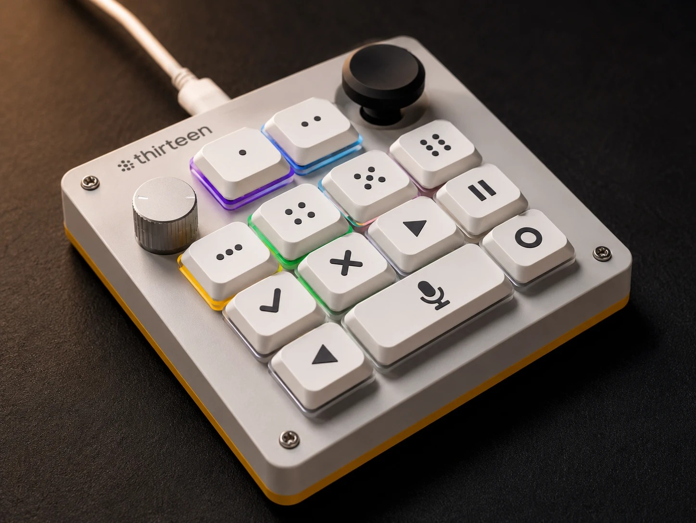

# thirteen

**A keyboard has 104 keys. When agents do the typing, you need thirteen:
status, approval, direction.**

An open-source, firmware-agnostic agent macropad: 13 mechanical keys, a
rotary encoder, a joystick, and per-key RGB that shows what your AI agents
are doing right now — thinking, running, waiting for you, done. Press a key
to approve. Flick the stick to steer.



## Why

OpenAI and Work Louder make a lovely version of this idea, the
[Codex Micro](https://openai.com/supply/co-lab/work-louder/): 13 keys,
encoder, joystick, $230 — and its agent features only work with one
vendor's desktop app.

thirteen is the DIY answer:

| | Codex Micro | thirteen |
|---|---|---|
| price | $230 | ~€30 in parts |
| keys / encoder / joystick | 13 / yes / yes | 13 / yes / yes |
| per-key RGB agent status | yes | yes |
| works with | Codex via ChatGPT desktop | anything (adapter pattern) |
| firmware | closed | this repo |
| case | CNC polycarbonate + aluminium | your 3D printer |

The core design principle: **the hardware knows nothing about any specific
agent.** The device is a plain USB HID keyboard plus a serial port speaking
newline-delimited JSON. All intelligence lives in a host-side daemon with
swappable adapters — Claude Code today, anything tomorrow, no reflash.

## Architecture

```
┌────────────┐ hooks  ┌──────────────────────┐   NDJSON    ┌──────────────┐
│ Claude Code├───────▶│                      │ over serial │   thirteen   │
└────────────┘        │    thirteen-host     │   115200 8N1 │  (ESP32-S3)  │
┌────────────┐ NDJSON │                      │             │              │
│ anything   ├───────▶│  adapters ──┐        │──── LEDs ──▶│ 13× SK6812   │
│ (stdin)    │        │  claude_code│ daemon │             │ 13× Choc     │
└────────────┘        │  generic_st…│  ────  │◀── events ──│ EC11 encoder │
┌────────────┐        │  demo      ─┘        │             │ 2-axis stick │
│ your agent ├───────▶│  config: one TOML    │             └──────┬───────┘
└────────────┘        └──────────────────────┘                    │ USB HID
                                                                  ▼
                                                        keystrokes (F13–F24)
                                                        straight to the OS
```

Two independent paths, by design:

- **Status path** (needs the daemon): adapter sees agent activity → daemon
  maps agent→key → LED shows state. Violet pulse = thinking, blue pulse =
  running, amber blink = **waiting for you**, green = done.
- **Action path** (works without any software): keys are a real HID
  keyboard typing F13–F24. Bind them in your terminal — approve, reject,
  interrupt — even if the daemon is down.

## Quickstart

**Have hardware?** Follow [docs/build-guide.md](docs/build-guide.md).
**Building from scratch?** [hardware/BOM.md](hardware/BOM.md) (~€30),
[hardware/WIRING.md](hardware/WIRING.md), printable case in
[hardware/case/](hardware/case/).

```sh
# 1. firmware (PlatformIO)
cd firmware && pio run -t upload && pio run -t uploadfs

# 2. host daemon
cd ../host && pip install -e .
cp config/thirteen.example.toml thirteen.toml   # set your port: /dev/ttyACM0 or COM3
thirteen-host

# 3. smoke test — a key should blink amber:
echo '{"agent_id":"hi","state":"waiting"}' | thirteen-host
```

Claude Code integration is a five-line hooks snippet:
[docs/adapter-guide.md](docs/adapter-guide.md).

## Adapters

| adapter | drives it | status |
|---------|-----------|--------|
| `claude_code` | Claude Code hooks; multi-session, one key per session | ✅ shipped |
| `generic_stdin` | NDJSON on stdin — shell scripts, Codex CLI, n8n, CI | ✅ shipped |
| `demo` | nothing; cycles states for testing | ✅ shipped |
| yours | ~50 lines of Python: [docs/adapter-guide.md](docs/adapter-guide.md) | 🙋 PRs welcome |

## Repo map

```
firmware/   ESP32-S3 PlatformIO project (USB HID + CDC, LittleFS keymap)
protocol/   PROTOCOL.md — the NDJSON serial contract, versioned
host/       thirteen-host Python daemon + adapters
hardware/   BOM, wiring, parametric OpenSCAD case
docs/       build guide, adapter authoring guide
```

## Contributing

Small repo, sharp edges welcome — see [CONTRIBUTING.md](CONTRIBUTING.md).
Especially wanted: adapters for other agents, hw-test reports (grep for
`TODO(hw-test)`), case remixes.

## License

[MIT](LICENSE).
